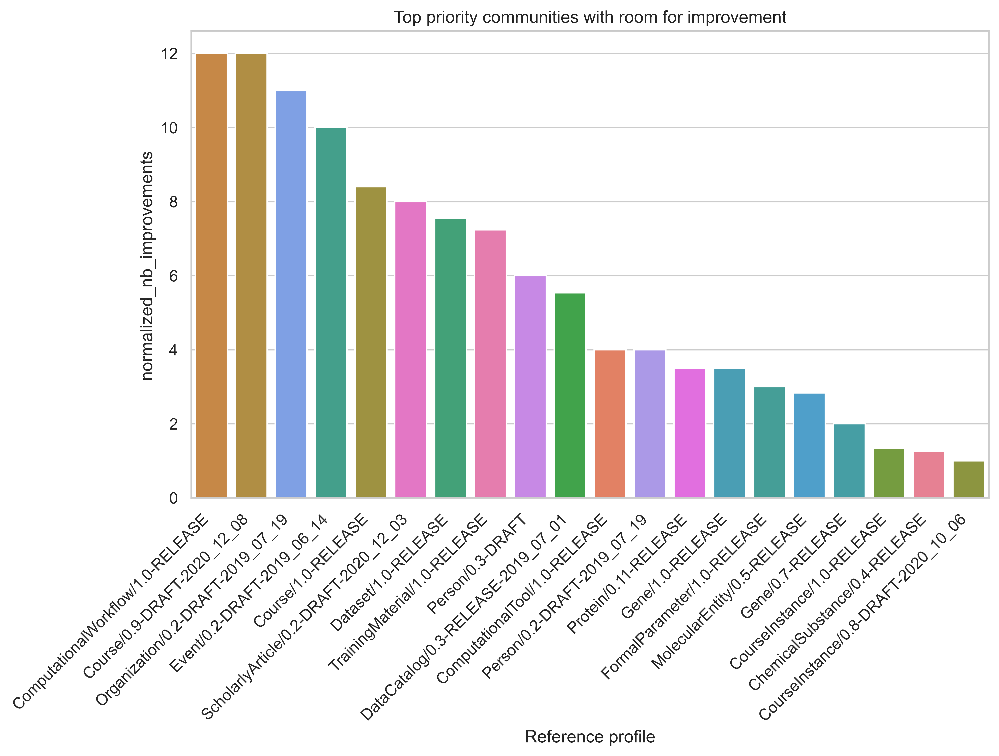

# 1. Introduction

The Bioschemas community seeks to improve the FAIRness of web-based science resources by defining domain-specific metadata schemas. When adopted, these metadata schema specifications expose key metadata properties from resource records, allowing users to find data quickly, accurately and efficiently. During the Biohackathon Europe 2022, we focused on improving our tooling, particularly to facilitate the Bioschemas Profile development process by automating the usage of outputs from the Data Discovery Engine (DDE)--a tool for creating, registering and editing schemas in a machine-readable format (JSON Schema/JSON-LD). Since then, we have been engaging with communities interested in updating Bioschemas profiles and types. 

While Biohackathon Europe 2022 enabled Bioschemas profiles and types to be available in a machine-readable format, it was unclear how the Bioschemas profiles and types were being used; there is no mechanism to identify users of Bioschemas unless they tell us. As a community, and to try and better focus our activities, we need to answer some important questions: Which profiles and types had the greatest adoption rates? Which profiles and types were problematic and had implementation issues? Were profiles being used correctly? How well did the communities developing the standard mesh with the communities applying the standards? To answer these questions, we will develop an assessment process which  aggregates Bioschemas markup from existing web resources. This will allow us to examine the overall usage of, and compliance to, Bioschemas specifications, as well as allowing us to identify common issues or misuse, and to compare the overall activity of Bioschemas development and adoption by the research community.

Interactions during Biohackathon 2022 Europe led to ongoing work on the development of new and existing types like Sample/BioSamples, however only the process to create and update profiles was developed at that time. The process to create or update ‘types’ is still a manual process requiring sufficient technical expertise. Hence, there is a glaring disconnect between profiles (which can be updated by community members) and the types upon which these profiles are built (which can require technical expertise). To improve the accessibility and value of Bioschemas to existing and emerging communities, we will first work with communities of practice at Biohackathon 2023 Europe to develop new or update existing Bioschemas Types. We will then use these new types as exemplar cases to address issues in the Bioschemas Type development process, in hopes of extending the Bioschemas specification process pipeline developed at Biohackathon 2022 Europe to include Bioschemas types.

Lastly, communities of practice outside of the life sciences have expressed reluctance to use Bioschemas due assumptions based on the name, “Bioschemas.” Many of the Bioschemas profiles and types are relevant to other domains of research, in spite of the name, “Bioschemas.” To encourage adoption of domain-agnostic  ‘Bioschemas’ profiles and types outside of the life science community, and improve standardization between domains of research, we developed a barebones site, https://schemas.science which would display domain-agnostic Bioschemas-developed profiles and types. To ensure that the Schemas.science site remains synchronous with Bioschemas, we would like to extend the automated Bioschemas website updates from the Bioschemas profile development process to schemas.science.

**Objectives**

 1. Assess the overall usage and compliance of bioschemas and identify common issues or misuse by collecting and analysing Bioschemas markup from existing web resources
 2. Engage with research communities to create new or update existing Bioschemas Types
 3. Utilising the new Bioschemas Types, develop an automated process to update the Bioschemas website from a DDE-generated JSON-LD representation of the new type
 4. Adapt the processes for automatically generating Bioschemas web page profiles and types to the generation of schemas.science pages.

# 2. Results 
## 2.1 Bioschemas usage analysis through Live Deploys 

The first part of this work consisted in assembling an RDF dataset based on the Bioschemas 140 live deploys URLS[^ld]

We developed a command line application supported by the FAIR-Checker[@Gaignard2023FAIRCheckerSD] API that harvests Bioschemas markup for a given web page and store the markup in an RDF file. This results in an RDF graph with 74 245 Schema.org triples[^rdf_crawl]. 

We automated the metadata harvesting through a weekly run GitHub action[^gh]. 

[^ld]: https://bioschemas.org/developer/liveDeploys
[^rdf_crawl]: https://github.com/BioSchemas/bioschemas-validation/tree/main/data 
[^gh]: https://github.com/BioSchemas/bioschemas-validation/blob/main/.github/workflows/gen_live_deploy_reports.yml

Table 1 and Table 2 report the top-20 most used classes and properties. In these table we can also identify some misspelling of Schema.org classes, and properties (e.g. @Type, DataSet)

Table 1. Top-20 most used Schema.org classes in Bioschemas live deploys. 

| Class | Count |
| -------- | -------- |
| http://schema.org/CreativeWork	| 14916 |
| http://schema.org/BioChemEntity	| 1085 |
| http://schema.org/DataDownload	| 910 |
| http://schema.org/creativeWork	| 714 |
| https://bioschemas.org/Taxon	| 714 |
| http://schema.org/Dataset	| 524 |
| http://schema.org/Organization	| 307 |
| http://schema.org/Person	| 256 |
| http://schema.org/DefinedTerm	| 159 |
| http://schema.org/MolecularEntity	| 113 |
| http://schema.org/DataSet	| 78 |
| http://schema.org/TaxonName	| 70 |
| http://schema.org/ChemicalSubstance	| 68 |
| http://schema.org/SequenceAnnotation	| 62 |
| http://schema.org/ScholarlyArticle	| 50 |
| http://schema.org/PropertyValue	| 47 |
| http://schema.org/SequenceRange	| 40 |
| http://schema.org/DataCatalog	| 32 |
| http://schema.org/PostalAddress	| 30 |
| http://schema.org/WebPage	| 28  |

Table 2. Top-20 most used Schema.org properties in Bioschemas live deploys. 

| Property | Count |
| -------- | -------- |
| http://www.w3.org/1999/02/22-rdf-syntax-ns#type | 20595 |
| http://schema.org/name | 20537 |
| http://schema.org/url | 12281 |
| http://schema.org/about | 5716 |
| http://schema.org/identifier | 1616 |
| http://schema.org/taxonRank | 1158 |
| http://schema.org/taxonomicRange | 1083 |
| http://schema.org/parentTaxon | 1078 |
| http://schema.org/@Type | 1074 |
| http://schema.org/studySubject | 1074 |
| http://schema.org/distribution | 916 |
| http://schema.org/description | 607 |
| http://schema.org/keywords | 578 |
| http://purl.org/dc/terms/conformsTo | 562 |
| http://schema.org/version | 444 |
| http://schema.org/author | 311 |
| http://schema.org/license | 200 |
| http://schema.org/contentURL | 178 |
| http://schema.org/creator | 164 | 
| http://schema.org/sameAs | 161 | 

Then, for each of the live deploy URLs, we computed the number of `dct:conformsTo` properties. Figure 1 highlights that a majority of live deploys do not expose `dct:conformsTo` properties. Since this proerti allows to link a Bioschemas profile to a set of Bioschemas annotations, this becomes problematic at the time of computationally validating the profiles. 

Figure 1. More than 60 live deploys expose dct:conformsTo properties whereas this property is absent for more than 70 live deploys. 

All these figures can be reproduced by re-executing the publicly available Jupyter notebooks[^nb_dumps][^nb_harvest]. 

[^nb_dumps]: https://github.com/BioSchemas/bioschemas-validation/blob/main/scripts/LiveDeploys-dump.ipynb
[^nb_harvest]: https://github.com/BioSchemas/bioschemas-validation/blob/main/scripts/Plots-Harvesting.ipynb

### 2.1.1 Profile-based analysis

Figure 2. Most used Bioschemas profiles in live deploys. 

For each of the live deploys we reused teh FAIR-Checker API to validate the profiles specified with `dct:conformsTo` properties. Figure 3 reports the number of *errors*, meaning that required properties are missing, and Figure 4 reports the number of *warnings*, meaning that recommended properties are missing. The numbers of *errors*/*warnings* have been normalized by the number of profile instances. 

Figure 3. Bioschemas profiles showing the highest number of missing required properties.  

Figure 4. Bioschemas profiles showing the highest number of missing recommended properties.  

All these figures can be reproduced by re-executing the publicly available Jupyter notebook[^nb_prof]. 

[^nb_prof]: https://github.com/BioSchemas/bioschemas-validation/blob/main/scripts/Plots-Validation.ipynb

### 2.1.2 Property-based analysis
In the provious analysis, we have been focusing on profiles. Now we would like to investigate the global usage of properties regardless of profiles. 

Figure 5. Most required Bioschemas properties considered as missing when live deploys are validated.  

Figure 6. Most recommended Bioschemas properties considered as missing when live deploys are validated.  

All these figures can be reproduced by re-executing the publicly available Jupyter notebook[^nb_prop]. 

[^nb_prop]: https://github.com/BioSchemas/bioschemas-validation/blob/main/scripts/Plots-Validation-Properties.ipynb

### 2.1.3 New types and profiles initiated
_DefinedTerm / DefinedTermSet_

The merits of establishing a Bioschemas profile for standardising DefinedTerm/DefinedTermSet were discussed with members of group #7. Prior to the Biohackathon, asynchronous discussions on the matter had been initiated multiple times, but did not result in the creation of a DefinedTerm profile because it was difficult to convey the compelling use case for a profile. After lengthy at discussions, compelling use cases were developed and an initial draft of the DefinedTerm set was collaboratively created with the members of Group #7. 

_LabProtocol / LabProcess_

Group #14 expressed interest in revising the Lab Protocol type to have additional properties and creating a new Lab Process type in order to better serve their needs. While it would be possible to update the LabProtocol type based on discussions, it would be difficult to create a new LabProcess type within the time constraints of the Biohackathon due to the established process outlined in the Bioschemas governance documents. To move forward on this issue, members of Group #14 have joined the Lab Protocols Working Group in Bioschemas and drafted an initial LabProcess type which will be processed after the Biohackathon.

### 2.1.4 Updating existing types
_Sample / BioSample_

At the end of Biohackathon 2022, a number of participants expressed interest in improving the Sample and BioSample types and profiles in Bioschemas. After Biohackathon 2022 Europe, these participants worked asynchronously on standardising the properties of these types, but were unable to regain the momentum from Biohackathon 2022. To support their efforts, we initiated discussions with a subject matter expert. Based on that discussion, we calculated the frequency of properties used across Sample records in a number of different ENA checklists. In addition, we created a survey to better understand expected popular properties from these lists, and  marginality of the properties currently in (or expected to be added to) the BioSample type. Participants from various projects at Biohackathon 2023, kindly provided thought-provoking responses for the open-ended questions of the survey.

Table 3 - Top 20 most frequent Sample-related properties in ENA checklists

| Label           | Counts | Grouping | 
|-----------------|--------| -------- | 
| collection date | 43 | collection date |
| geographic location (country and/or sea)| 43|Place|
| geographic location (region and locality)|33|Place|
|geographic location (latitude)|31|Place|
|geographic location (longitude)|31|Place|
|amount or size of sample collected|28|sample size|
|broad-scale environmental context|26|Description|
|local environmental context|26|Description|
|project name|25|--|
|nucleic acid extraction|25|sample process|
|environmental medium|25||
|sample material processing|23|sample process|
|adapters|23||
|nucleic acid amplification|23|sample process|
|source material identifiers|23|identifiers|
|multiplex identifiers|22|identifiers|
|reference for biomaterial|22|identifiers/citation|
|experimental factor|22||
|relevant electronic resources|22|reference/citation|
|relevant standard operating procedures|22|reference/citation|

The full table is available in the GitHub repository for the Biohackathon: https://github.com/elixir-europe/biohackathon-projects-2023/tree/main/23 

Figure 7. Areas of expertise of survey respondents

Figure 8. Relations between samples and specimens

Figure 9. Distribution of expected Marginality for sample-related properties

### 3 Discussion
Based on the results of the assessment of Bioschemas usage, the use of `dct:conformsTo` was limited, hampering our assessment. We need to ensure that this property is utilised if we want to improve our ability to evaluate live deploy URLs. From the FAIR-Checker perspective, there are ongoing activities aimed at suggesting the closest profile, in the absence of `dct:conformsTo` property. The profile-based analysis told us that some communities using properties such as Dataset, DataCatalog, ComputationalWorkflow, ComputationalTool, or TrainingMaterial, could be prioritised for support  to increase the quality of their exposed metadata. Furthermore, a deeper analysis of the FAIR-Checker results of live deploys would enable us to identify consistent misuse or profiles/properties; where there is ‘consistent’ misuse, it is likely to indicate either a badly described profile, inadequately specified properties, or else inappropriate implementation of markup. In all these cases, we can target the ‘Bioschemas group’ responsible for the profile or property, or else the resources that are implementing these profiles, and offer them direct assistance. The property-based analysis revealed `schema:url` to be the property that led to the greatest number of validation errors (Fig. 5). Therefore, improving use of the schema:url property will drastically reduce the number of validation errors, and have a high impact on Bioschemas metadata quality across all live deploys.

With respect to implementing the final piece of our user-centric pipeline, which would enable non-expert users to contribute Bioschemas profiles and types, while we have made significant progress, we have underestimated the time required for this component; to facilitate development of this component, we engaged with users and experts in the biodiversity/sample domains to identify requirements for a ‘BioSample’ type. Over the course of the Biohackathon, we engaged with participants and surveyed others to help identify important properties. Since we were overcommitted with other work, we decided to process the requirements gathering stage further at the German Biohackathon.

# 4. Future work

And maybe you want to add a sentence or two on how you plan to continue. Please keep reading to learn about citations and references.

# Jupyter notebooks, GitHub repositories and data repositories

* Bioschemas validation repo: https://github.com/BioSchemas/bioschemas-validation
* 

# Contributions
NJ introduced the project and furnished all required progress reports at BH2023. AG and GT led the writing of the BioHackRxiv report, supported by NJ. AG conducted the assessment of Bioschemas usage. NJ, LJG, AG and GT engaged in Bioschemas discussions with other projects. GT generated the property frequency for Samples in ENA and created and distributed the Survey.

# Acknowledgements
Much of this work and key discussions were initiated at the ELIXIR Biohackathon Europe, 2023 held in November. We thank ELIXIR, the research infrastructure for life-science data, for organising and sponsoring this event which gathered individuals from different communities of practice enabling us to make progress on several Bioschemas community efforts. We thank Joana Pauperio, Sebastian Beier, Sveinung Gundersen, Stuart Owen, , Sara EL-Gebali,  Rahuman Sheriff Malik Sheriff, Cyril Pommier,  Daniel Arend, Ivan Mičetić and Steffan Neumann for engaging in and/or organising fruitful discussions. We would also like to thank the following hackathon participants for their thoughtful responses to our survey: Sara Carsanaro, Sebastian Beier, Sam Leeflang, Alice Dennis, Hannah Dörpholz, Marco Brandizi, Justin van der Hooft, Elena Del Pup, Felicia Wolters. Lastly, we would especially like to thank Chloe Llewellyn, Katharina Heil, David Lloyd and other members of the Biohackathon organising committee for their ongoing support throughout the event.

# References
